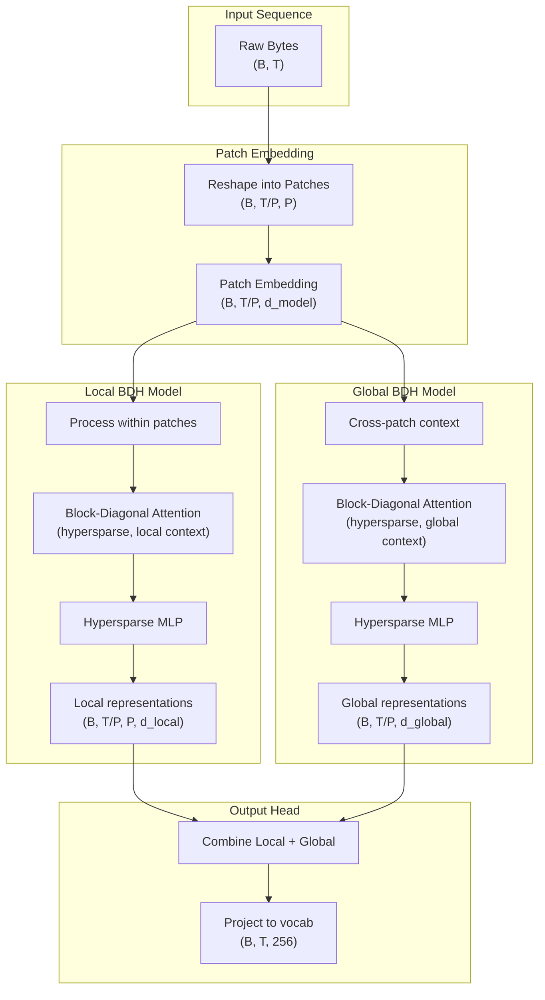

# 📓 BDH Notebooks

Experimental notebooks for training, evaluating, and testing **Hierarchical BDH** (Block-Diagonal Hypersparse) language models.

---

## 🧠 What is Hierarchical BDH?

Hierarchical BDH extends the original BDH architecture with a **two-stage local→global design** inspired by [MEGABYTE](https://arxiv.org/abs/2305.07185) (Yu et al., 2023), but using BDH's block-diagonal hypersparse attention at both levels.

### Architecture Overview



### Key Innovations

| Component | Description | Benefit |
|-----------|-------------|--------|
| **Byte-level** | Operates on raw bytes (vocab=256) | No tokenizer needed, handles any text/code |
| **Block-Diagonal Attention** | Sparse attention with learned block structure | O(n) memory scaling vs O(n²) for dense |
| **Hypersparse MLP** | Extreme sparsity in feed-forward layers | Composable representations, efficient compute |
| **Local→Global** | Two-stage hierarchical processing | Captures both fine-grained and long-range patterns |
| **Patch-based** | Groups bytes into patches (e.g., 16-32 bytes) | Enables efficient global context modeling |

### Theoretical Properties (Under Investigation)

The BDH paper claims several remarkable properties that these notebooks help test:

1. **Unlimited Context Length** - Linear memory scaling enables arbitrarily long sequences
2. **Model Composability** - Hypersparse representations allow concatenating separately-trained models
3. **Extreme Sparsity** - >99% sparsity in activations without performance loss
4. **Efficient Scaling** - Sublinear compute scaling with sequence length

---

## 📊 Notebook Categories

### 🏋️ Training Notebooks

Notebooks for training Hierarchical BDH on various datasets:

| Notebook | Dataset | Purpose | Config |
|----------|---------|---------|--------|
| [`train_hierarchical_wikitext2.ipynb`](train_hierarchical_wikitext2.ipynb) | WikiText-2 | Quick experiments, validation | tiny/small |
| [`train_hierarchical_wikitext103.ipynb`](train_hierarchical_wikitext103.ipynb) | WikiText-103 | Larger scale language modeling | small/base |
| [`train_hierarchical_pg19.ipynb`](train_hierarchical_pg19.ipynb) | PG-19 (books) | Long-form text, 100K+ context | base/large |
| [`train_hierarchical_code.ipynb`](train_hierarchical_code.ipynb) | The Stack (code) | Code understanding & generation | small/base |
| [`train_tool_calling.ipynb`](train_tool_calling.ipynb) | Function-calling datasets | Tool use for agents (pydantic-ai) | large |
| [`train_wikitext2.ipynb`](train_wikitext2.ipynb) | WikiText-2 | **Baseline** (non-hierarchical BDH) | small |

### 🔬 Claim Testing Notebooks

Notebooks designed to empirically validate BDH's theoretical claims:

| Notebook | Claim Tested | Method |
|----------|--------------|--------|
| [`test_unlimited_context.ipynb`](test_unlimited_context.ipynb) | Unlimited context length | Memory profiling at 1K→1M tokens |
| [`test_sparsity_claims.ipynb`](test_sparsity_claims.ipynb) | Extreme sparsity | Activation analysis, sparsity metrics |
| [`test_model_composability.ipynb`](test_model_composability.ipynb) | Model concatenation | Train separate models, compose, evaluate |
| [`test_scaling_properties.ipynb`](test_scaling_properties.ipynb) | Efficient scaling | FLOPs/memory vs sequence length |

### 📈 Evaluation & Fine-tuning

| Notebook | Purpose |
|----------|--------|
| [`eval_benchmarks.ipynb`](eval_benchmarks.ipynb) | Upload trained models, run standard LM benchmarks |
| [`finetune_hierarchical.ipynb`](finetune_hierarchical.ipynb) | Fine-tune pre-trained checkpoints on new data |
| [`curriculum_training.ipynb`](curriculum_training.ipynb) | Progressive context length training |
| [`curriculum_training_v2.ipynb`](curriculum_training_v2.ipynb) | Improved curriculum with better scheduling |

---

## 🚀 Quick Start

### 1. Start with WikiText-2 (Fastest)

```bash
# Open in Colab or locally
jupyter notebook train_hierarchical_wikitext2.ipynb
```

- **Time**: ~20-40 minutes on A100
- **VRAM**: ~8-12GB for small config
- **Expected Results**: BPB ~0.24-0.30

### 2. Test the Claims

After training, use the test notebooks:

```bash
# Test memory scaling
jupyter notebook test_unlimited_context.ipynb

# Test sparsity
jupyter notebook test_sparsity_claims.ipynb
```

### 3. Scale Up

Once validated, train on larger datasets:

```bash
# WikiText-103 for more data
jupyter notebook train_hierarchical_wikitext103.ipynb

# PG-19 for long context
jupyter notebook train_hierarchical_pg19.ipynb

# Code for programming tasks
jupyter notebook train_hierarchical_code.ipynb
```

---

## 📐 Model Configurations

Hierarchical BDH provides preset configurations:

```python
from hierarchical_bdh import HierarchicalBDHConfig

# Available presets
config = HierarchicalBDHConfig.tiny()    # ~2M params, quick testing
config = HierarchicalBDHConfig.small()   # ~15M params, good baseline  
config = HierarchicalBDHConfig.base()    # ~50M params, solid performance
config = HierarchicalBDHConfig.large()   # ~150M params, best quality
```

| Config | Params | d_model | Local Layers | Global Layers | Patch Size | Est. VRAM |
|--------|--------|---------|--------------|---------------|------------|----------|
| tiny | ~2M | 128 | 2 | 2 | 16 | ~2GB |
| small | ~15M | 256 | 4 | 4 | 16 | ~8GB |
| base | ~50M | 384 | 6 | 6 | 32 | ~20GB |
| large | ~150M | 512 | 8 | 8 | 32 | ~40GB |

---

## 📊 Expected Results

### WikiText-2 Benchmarks

| Model | BPB | Perplexity | Notes |
|-------|-----|------------|-------|
| Hierarchical BDH (small) | ~0.24 | ~1.2 | Val set |
| Hierarchical BDH (base) | TBD | TBD | - |
| Base BDH (small) | ~0.30 | ~1.4 | Comparison |
| MEGABYTE (reported) | ~0.94 | - | Different setup |

*Note: These are byte-level metrics. Lower BPB = better compression.*

### Key Metrics Explained

- **BPB (Bits Per Byte)**: How many bits needed to encode each byte. Lower is better.
  - Random: 8.0 BPB
  - Good byte-level model: 0.8-1.2 BPB
  - Excellent: <0.5 BPB
  
- **Perplexity**: Exponential of cross-entropy loss. Lower is better.
  - For byte-level: typically 1.0-2.0 range
  - For token-level: typically 10-30 range

---

## 🔧 Hardware Requirements

| Setup | Recommended Config | Notes |
|-------|-------------------|-------|
| Colab Free (T4) | tiny | Limited, good for testing |
| Colab Pro (A100) | small/base | Recommended for experiments |
| RunPod A100 40GB | base/large | Full training runs |
| RunPod A100 80GB | large | Long context, big batches |
| Multi-GPU | large+ | For scaling experiments |

---

## 🧪 Composability Experiment

One of BDH's most interesting claims is **model composability** - the ability to concatenate separately trained models:

```
┌──────────────────────────────────────────────────────────────┐
│                    COMPOSABILITY VISION                       │
├──────────────────────────────────────────────────────────────┤
│                                                              │
│  ┌─────────────┐   ┌─────────────┐   ┌─────────────┐        │
│  │  Language   │ + │    Code     │ + │    Tool     │ = 🤖   │
│  │   Model     │   │   Model     │   │   Model     │        │
│  │ (WikiText)  │   │ (TheStack)  │   │  (Glaive)   │        │
│  └─────────────┘   └─────────────┘   └─────────────┘        │
│                                                              │
│  If BDH's hypersparsity claim holds, these should compose   │
│  without catastrophic interference!                          │
└──────────────────────────────────────────────────────────────┘
```

The [`test_model_composability.ipynb`](test_model_composability.ipynb) notebook provides tools to:
1. Train models on different domains
2. Concatenate their weights
3. Evaluate on mixed tasks
4. Measure interference/retention

---

## 📚 References

- **BDH Paper**: [Block-Diagonal Hypersparse Attention](https://arxiv.org/abs/...) *(link TBD)*
- **MEGABYTE**: [Yu et al., 2023](https://arxiv.org/abs/2305.07185) - Inspiration for hierarchical design
- **Byte-level LMs**: [Xue et al., 2022](https://arxiv.org/abs/2105.13626) - ByT5 background
- **Sparse Attention**: [Child et al., 2019](https://arxiv.org/abs/1904.10509) - Sparse Transformers

---

## 🤝 Contributing

These notebooks are experimental! If you find interesting results:

1. **Document your findings** - Update expected results
2. **Share checkpoints** - Help others reproduce
3. **Report issues** - Especially around the theoretical claims
4. **Suggest improvements** - PRs welcome!

---

## 📝 License

Same as the main BDH repository.
