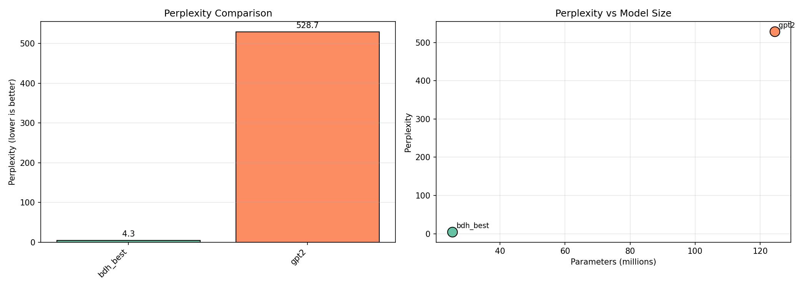

# Benchmark Report

**Generated**: 2026-01-08 18:39:29  
**Dataset**: shakespeare  
**Split**: val  

## Results

| Rank | Model | Perplexity | Loss | Params | Tokens/sec |
|------|-------|------------|------|--------|------------|
| 1 | bdh_best | 4.28 | 1.4528 | 25.3M | 5511 |
| 2 | gpt2 | 528.68 | 6.2704 | 124.4M | 11393 |


## Analysis

**Winner**: bdh_best with perplexity 4.28

### Key Observations

- BDH perplexity: 4.28 vs GPT-2: 528.68 (ratio: 0.01x)
- GPT-2 has 4.9x more parameters than BDH
- Perplexity per million params: BDH=0.169, GPT-2=4.249

## Comparison Chart



## Configuration

```json
{
  "models": [
    "bdh:checkpoints/best.pt",
    "gpt2"
  ],
  "dataset": "shakespeare",
  "split": "val",
  "block_size": 256,
  "batch_size": 4
}
```
