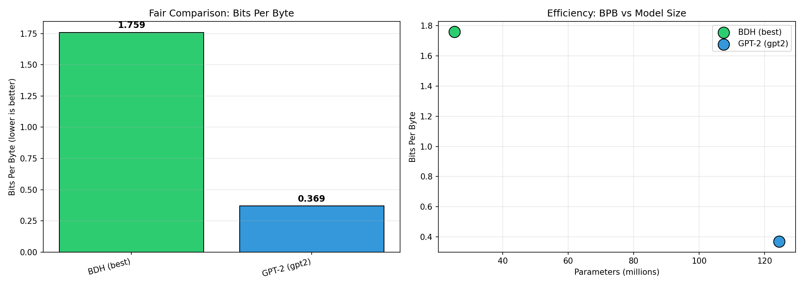

# Bits-Per-Byte Comparison Report

**Generated**: 2026-01-08 18:41:45  
**Text Source**: data/shakespeare.txt  

## Why Bits-Per-Byte?

Comparing byte-level models (BDH) to BPE models (GPT-2) using perplexity is **unfair**:
- BDH perplexity: uncertainty over 256 possible bytes
- GPT-2 perplexity: uncertainty over 50,257 possible tokens

**Bits-Per-Byte (BPB)** is the fair metric:
- Measures compression efficiency on the same text
- Lower = better (model compresses text more efficiently)
- 1.0 BPB = 1 bit of information per byte of text

## Results

| Rank | Model | BPB | Params | Type |
|------|-------|-----|--------|------|
| 1 | GPT-2 (gpt2) | **0.369** | 124.4M | BPE |
| 2 | BDH (best) | **1.759** | 25.3M | byte-level |


## Analysis

**Winner**: GPT-2 (gpt2) with 0.369 bits per byte

### Efficiency Comparison

- BDH BPB: 1.759 vs GPT-2 BPB: 0.369
- BPB ratio: 4.77x (GPT-2 better)
- Parameter ratio: GPT-2 has 4.9x more parameters
- BPB per million params: BDH=0.0695, GPT-2=0.0030

GPT-2 achieves 376.7% better compression, but uses 4.9x more parameters.

## Chart



## Raw Data

```json
[
  {
    "model": "BDH (best)",
    "type": "byte-level",
    "bpb": 1.7590606126661577,
    "perplexity": 3.3847765897206026,
    "loss": 1.219287904103597,
    "tokens_evaluated": 30720,
    "params": 25296896,
    "bytes_in_text": 1115394
  },
  {
    "model": "GPT-2 (gpt2)",
    "type": "BPE",
    "bpb": 0.3690404440591734,
    "perplexity": 10803.921802205106,
    "loss": 9.287664477030436,
    "tokens_evaluated": 30720,
    "params": 124439808,
    "bytes_in_text": 1115394,
    "bpe_tokens": 338025
  }
]
```
