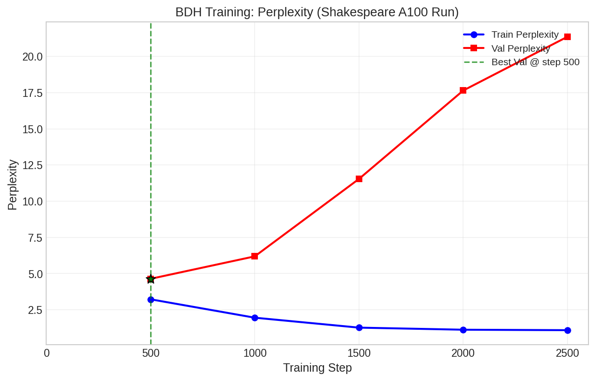
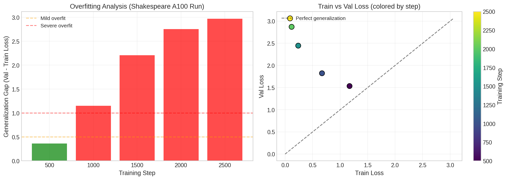
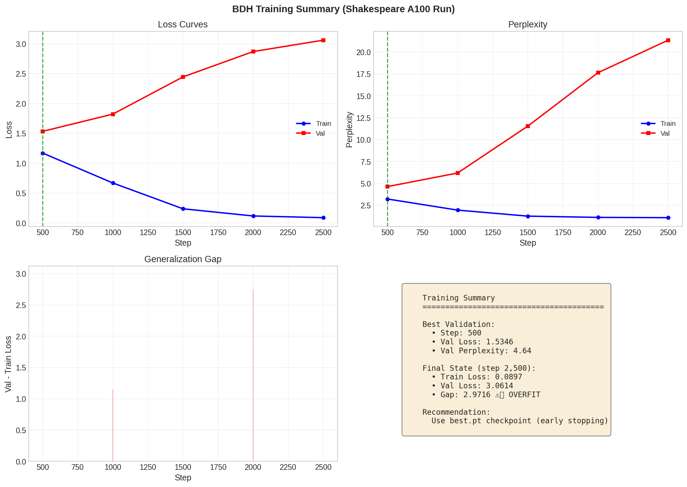

# Training Report

**Source**: `checkpoints/train_log.csv`  
**Generated**: Auto-generated by `plot_training.py`

## Summary

| Metric | Value |
|--------|-------|
| Total Steps | 2,500 |
| Best Val Loss | 1.5346 (step 500) |
| Best Val Perplexity | 4.64 |
| Final Train Loss | 0.0897 |
| Final Val Loss | 3.0614 |
| Generalization Gap | 2.9716 |

## Observations

⚠️ **Overfitting detected!** Val loss increased significantly after step 500. Use `best.pt` checkpoint.

## Charts

### Loss Curves


### Perplexity


### Overfitting Analysis


### Full Summary


## Raw Data

```
   step  train_loss  val_loss  train_ppl    val_ppl
0   500    1.171463  1.534606   3.226708   4.639499
1  1000    0.670582  1.823135   1.955375   6.191240
2  1500    0.238311  2.445891   1.269104  11.540824
3  2000    0.118111  2.870443   1.125369  17.644827
4  2500    0.089733  3.061358   1.093882  21.356530
```
